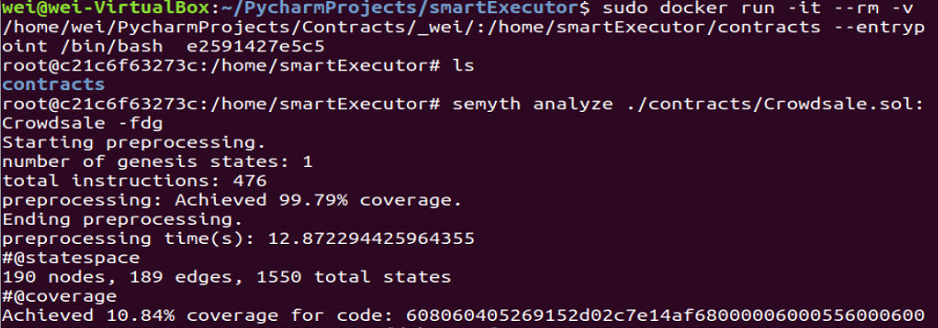

##  SmartExecutor ##

SmartExecutor is built on top of [Mythril](https://github.com/ConsenSys/mythril), a symbolic-execution-based security analysis tool for EVM bytecode that can detect security vulnerabilities in smart contracts built for Ethereum, Hedera, Quorum, Vechain, Roostock, Tron and other EVM-compatible blockchains.

SmartExecutor is designed to reduce the sequence explosion of symbolic execution on smart contracts. It provides a scalable solution to symbolic execution while still keeping the basic features of Mythril.


###  Run SmartExecutor in Docker Container: ###

Download the Docker image of SmartExecutor.
```bash
$ docker pull 23278942/smartexecutor
```

Create and enter the docker container. 
```
sudo docker run -it --rm -v solidity_file_path_in_host:/home/smartExecutor/contracts --entrypoint /bin/bash docker_image_id 
```

Run the following command to execute contract **contract_name** in solidity_file_name.sol in the container.
```
semyth analyze ./contracts/solidity_file_name.sol:contract_name -fdg
```


Example of executing contract Crowdsale in Crowdsale.sol in the Docker container:



_/home/wei/PycharmProjects/Contracts/\_wei/_: the host directory where Crowdsale.sol resides in it.

_/home/smartExecutor/contracts_: the directory in a container, no need to change it.

_e2591427e5c5_: the Docker image id of smartexecutor.

### Run SmartExecutor in Pycharm IDE: ###

1, Create a project through Pycharm IDE by cloning https://github.com/contractAnalysis/smartExecutor.git.

2, Create a virtual environment and install dependencies.

3, Find semyth.py in the root directory and add the parameters. Take the example of Crowdsale.sol:
```
analyze
./tests/testdata/input_contracts/Crowdsale.sol:Crowdsale
-fdg
```
4, Run semyth.py by right clicking it and select "Run semyth".

5, Check results in the Pycharm terminal. Here shows the results of evaluating Crowdsale.sol:
```
Starting preprocessing.
number of genesis states: 1
total instructions: 476
preprocessing: Achieved 99.79% coverage.
Ending preprocessing.
preprocessing time(s): 3.5448732376098633
#@statespace
190 nodes, 189 edges, 1547 total states
#@coverage
Achieved 10.34% coverage for code: 608060405269152d02c7e14af680000060005560006001553...
#@coverage
Achieved 99.79% coverage for code: 60806040526004361061006d576000357c010000000000000...
==== Integer Arithmetic Bugs ====
SWC ID: 101
Severity: High
Contract: Crowdsale
Function name: constructor
PC address: 42
Estimated Gas Usage: 21038 - 103767
The arithmetic operator can overflow.
It is possible to cause an integer overflow or underflow in the arithmetic operation. 
--------------------
In file: ./tests/testdata/input_contracts/Crowdsale.sol:10

now+60 days

--------------------
Initial State:

Account: [CREATOR], balance: 0x0, nonce:0, storage:{}
Account: [ATTACKER], balance: 0x0, nonce:0, storage:{}

Transaction Sequence:

Caller: [CREATOR], calldata: , decoded_data: , value: 0x0

==== Dependence on predictable environment variable ====
SWC ID: 116
Severity: Low
Contract: Crowdsale
Function name: setPhase(uint256)
PC address: 415
Estimated Gas Usage: 2729 - 2824
A control flow decision is made based on The block.timestamp environment variable.
The block.timestamp environment variable is used to determine a control flow decision. Note that the values of variables like coinbase, gaslimit, block number and timestamp are predictable and can be manipulated by a malicious miner. Also keep in mind that attackers know hashes of earlier blocks. Don't use any of those environment variables as sources of randomness and be aware that use of these variables introduces a certain level of trust into miners.
--------------------
In file: ./tests/testdata/input_contracts/Crowdsale.sol:19

require (
    (newPhase==1 && raised>=goal) ||
    (newPhase==2 && raised<goal && now>end))

--------------------
Initial State:

Account: [CREATOR], balance: 0x0, nonce:0, storage:{}
Account: [ATTACKER], balance: 0x0, nonce:0, storage:{}

Transaction Sequence:

Caller: [CREATOR], calldata: , decoded_data: , value: 0x0
Caller: [ATTACKER], function: setPhase(uint256), txdata: 0x2cc826550000000000000000000000000000000000000000000000000000000000000002, decoded_data: (2,), value: 0x0


#@time
time used(s):26.79217028617859

Process finished with exit code 0

```

### Run SmartExecutor as a Package ###

Install SmartExecutor through pip:
```
pip install smartExecutorx
```

Run SmartExecutor:

```bash
$ semyth analyze <solidity-file>:<contract-name> -fdg
```

Note that the usage of SmartExecutor is almost the same as Mythril except that you have to begin with **semyth** instead of **myth** and you need to include the option **-fdg**, which is used to signal that the scalable alternative is in active. When **-fdg** is not given, SmartExecutor runs the basic model, i.e., Mythril itself.

For this reason, here show some useful documents of Mythril:

- [Instructions for using Mythril](https://mythril-classic.readthedocs.io/en/master/)
- [Mythril's documentation](https://mythril-classic.readthedocs.io/en/develop/)
- [Vulnerability Remediation](https://swcregistry.io/)
